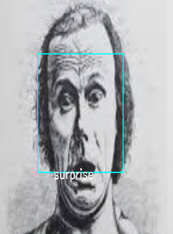

# Emotion-Detection

1.    Dataset:-

a) In this project, the Kaggle dataset is used for training & testing the model. 

b) The dataset is comprised of 24,336 training samples and 3,479 testing samples which have 128x128 image size.

2.    Algorithm:-

a)  In this project, deep learning algorithm CNN (Convolutional Neural Network) is used for building the network and I get 81.00% accuracy in 20 epochs.

b)  ReLu & SoftMax activation function are use.

3.    About:-

a)  In this OpenCV is used for making it a real-time emotion detection system through a webcam. 

b)  It can easily detect multiple face emotion by making a rectangle over every face with predicting emotion.

     
    

     

